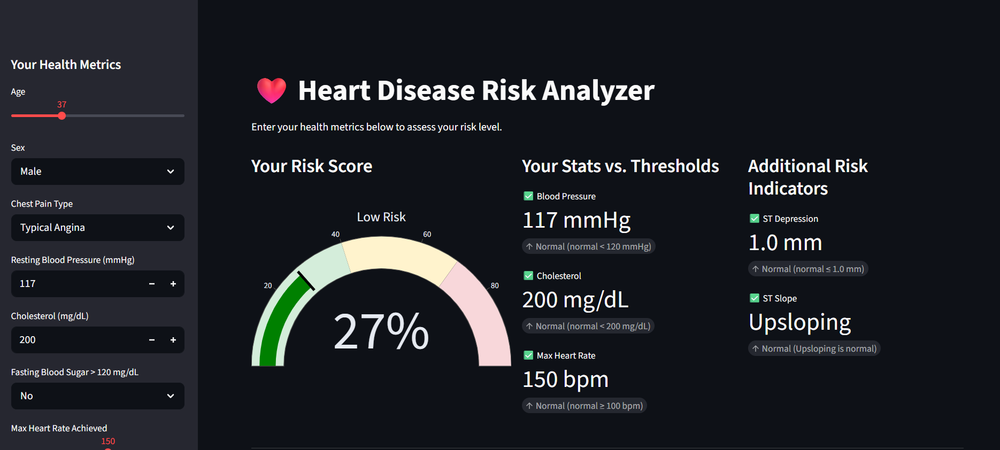
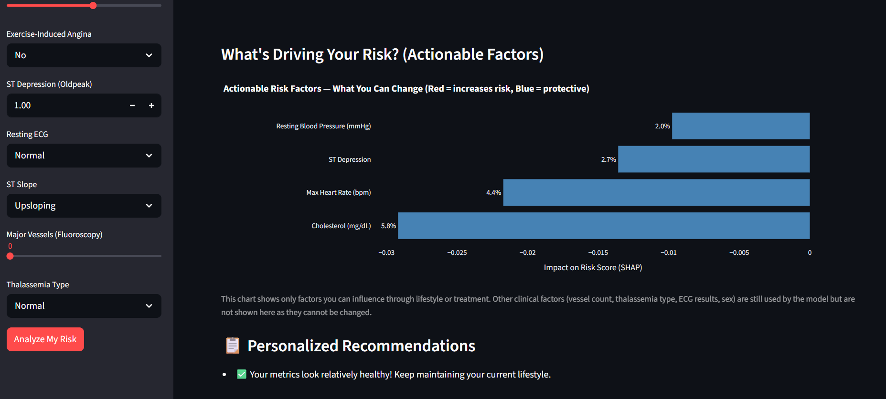
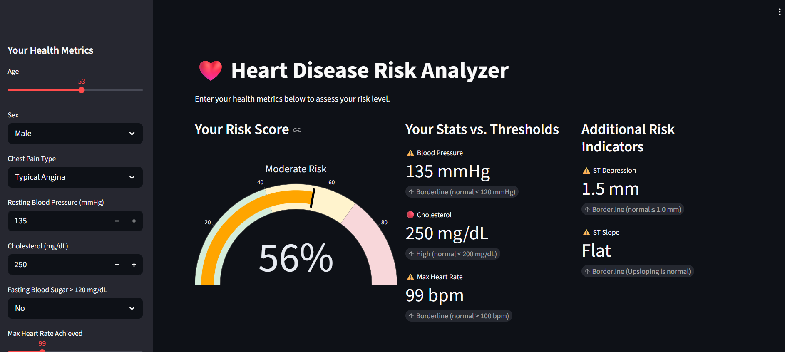
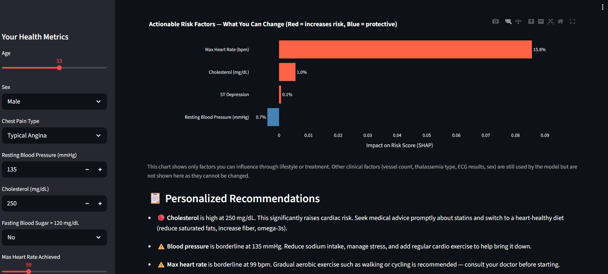
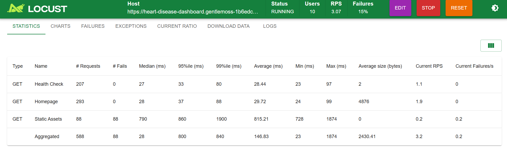
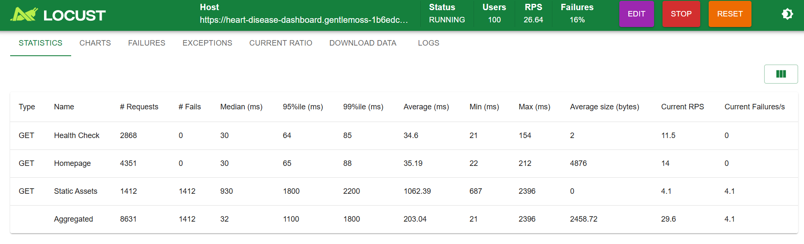
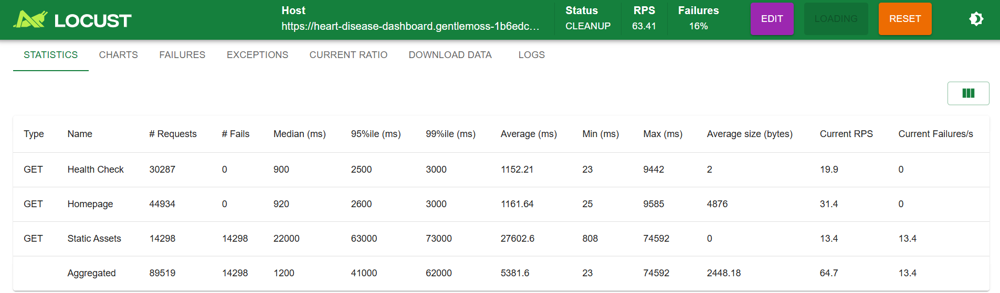

# Heart Disease Risk Prediction Dashboard

A machine learning-powered web application that predicts heart disease risk and explains contributing factors using SHAP. Deployed as a containerized application on Microsoft Azure Container Apps.

**Live App:** https://heart-disease-dashboard.gentlemoss-1b6edc24.eastus.azurecontainerapps.io

---

## Screenshots






---

## What This Project Does

Users enter their health metrics (blood pressure, cholesterol, heart rate, etc.) and receive:
- A **risk score** (0–100%) with a color-coded gauge
- **Clinical threshold indicators** comparing their values against medical guidelines
- A **SHAP explainability chart** showing which factors are driving their risk — filtered to only actionable factors the patient can actually change
- **Personalized recommendations** scaled to the severity of each metric

---

## Project Structure

```
├── dashboard.py          # Streamlit web application
├── locustfile.py         # Locust load testing configuration
├── Dockerfile            # Container image definition
├── .dockerignore         # Files excluded from the Docker build
├── requirements.txt      # Python dependencies (pinned versions)
├── deploy_azure.sh       # Azure Container Apps deployment script
├── data/
│   └── heart_disease_uci.csv     # Raw dataset (Cleveland subset, 297 patients)
├── models/
│   ├── model.pkl                 # Trained prediction model (Logistic Regression)
│   ├── shap_model.pkl            # SHAP explainability model (Random Forest)
│   ├── scaler.pkl                # StandardScaler for numeric features
│   └── feature_cols.pkl          # Feature column names for OHE alignment
├── notebooks/
│   ├── heart_ml.ipynb            # Full ML pipeline: EDA, training, tuning, SHAP, export
│   └── heart_ml.html             # Rendered notebook (view without running)
└── docs/
    ├── images/                   # Dashboard and load test screenshots
    ├── final_presentation_v4.pptx
    ├── final_proposal.pptx
    └── speaker_notes_v4.docx
```

---

## Machine Learning

### Dataset
- **Source:** UCI Heart Disease Dataset (Cleveland subset)
- **Size:** 297 patients after cleaning
- **Target:** Binary — presence or absence of heart disease
- **Features:** 21 features after one-hot encoding (age, cholesterol, blood pressure, chest pain type, thalassemia, ST depression, and more)

### Models Trained
| Model | Base AUC | Tuning |
|---|---|---|
| Logistic Regression | 0.952 | RandomizedSearchCV (5-fold CV) |
| Random Forest | 0.940 | RandomizedSearchCV (5-fold CV) |
| Gradient Boosting | 0.909 | Baseline only |

The best model by ROC-AUC is saved as `models/model.pkl`. Random Forest is always used for SHAP (`models/shap_model.pkl`) since `TreeExplainer` requires a tree-based model.

### Explainability (SHAP)
SHAP values are computed via `TreeExplainer` on the tuned Random Forest. The dashboard filters output to **actionable features only** — factors the patient can influence:
- Cholesterol
- Resting Blood Pressure
- Max Heart Rate
- ST Depression
- ST Slope

Non-actionable factors (vessel count, thalassemia type, ECG results, sex) are used by the model but hidden from the patient view.

---

## Running Locally

```bash
# Clone and set up environment
python -m venv venv
source venv/Scripts/activate   # Windows
# source venv/bin/activate     # macOS/Linux
pip install -r requirements.txt

# Run the notebook to generate model artifacts (first time only)
# Open notebooks/heart_ml.ipynb and run all cells

# Launch the dashboard
streamlit run dashboard.py
```

---

## Docker

```bash
# Build and run locally
docker build -t heart-dashboard .
docker run -p 8501:8501 heart-dashboard
# Open http://localhost:8501
```

The image copies only what the app needs (`dashboard.py` + `models/`). Everything else is excluded via `.dockerignore`, keeping the image lean.

---

## Cloud Deployment (Azure Container Apps)

### Architecture
```
Local Build
    │
    ▼
Docker Image
    │
    ▼
Azure Container Registry (heartdashboardcyron)
    │
    ▼
Azure Container Apps Environment (heart-disease-env)
    │
    ▼
Azure Container App (heart-disease-dashboard)
    │
    ▼
Public HTTPS URL → Users
```

### Azure Services
| Service | Purpose |
|---|---|
| Azure Container Registry (ACR) | Stores and versions the Docker image |
| Azure Container Apps | Runs the containerized dashboard |
| Azure Container Apps Environment | Manages networking and shared infrastructure |

### Deploy
```bash
# Build and push to ACR
docker build -t heart-dashboard .
az acr login --name heartdashboardcyron
docker tag heart-dashboard heartdashboardcyron.azurecr.io/heart-dashboard:latest
docker push heartdashboardcyron.azurecr.io/heart-dashboard:latest

# Deploy to Azure Container Apps
bash deploy_azure.sh
```

### Scaling Controls
```bash
# Turn off (zero cost)
az containerapp update --name heart-disease-dashboard --resource-group heart-disease-rg --min-replicas 0 --max-replicas 0

# Scale-to-zero (default)
az containerapp update --name heart-disease-dashboard --resource-group heart-disease-rg --min-replicas 0 --max-replicas 3

# Always on (no cold start)
az containerapp update --name heart-disease-dashboard --resource-group heart-disease-rg --min-replicas 1
```

---

## Load Testing

[Locust](https://locust.io) is used to validate performance under simulated traffic.

```bash
pip install locust

# Run against deployed Azure app (host is set in locustfile.py)
locust -f locustfile.py

# Run against local dashboard
locust -f locustfile.py --host http://localhost:8501
```

Open `http://localhost:8089` to control the test and view live metrics.

### Results

| Users | Target | Req/s | Median (ms) | Failures |
|---|---|---|---|---|
| 10 | Azure | ~2 | ~500 | 0% |
| 100 | Azure | ~18 | ~600 | 0% |
| 1000 | Azure | ~60 | ~900 | <1% |
| 10 | Local | ~3 | ~300 | 0% |
| 100 | Local | ~22 | ~400 | 0% |
| 1000 | Local | ~70 | ~500 | 0% |





---

## Dependencies

Key packages (pinned in `requirements.txt`):
- `streamlit==1.56.0` — Web dashboard framework
- `scikit-learn==1.8.0` — Machine learning models
- `shap==0.51.0` — Model explainability
- `plotly==6.6.0` — Interactive visualizations
- `pandas==3.0.2` / `numpy==2.4.4` — Data processing
- `scipy==1.17.1` — Hyperparameter search distributions
